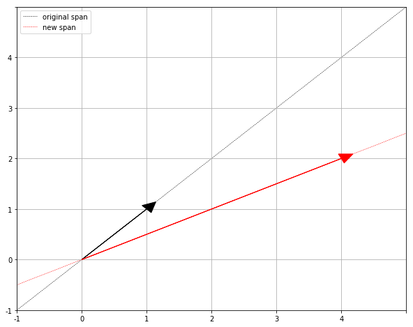
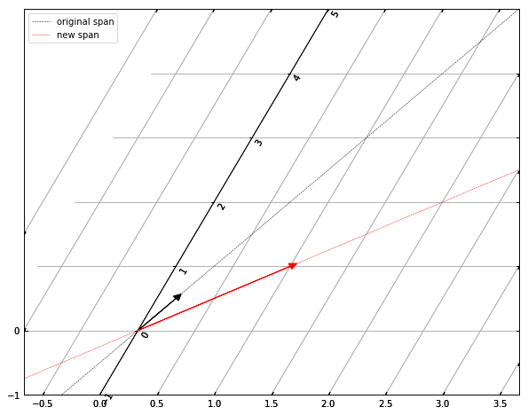

# Eigenvectors and Eigenvalues

Consider the Linear Transformation matrix $T$:

$$T(X) = \begin{bmatrix} 3 & 1 \\ 0 & 2 \end{bmatrix} X$$

What happens to a particular vector and its span? Most vectors will be knocked off their span during the transformation.

|  |  |
|-----------------------------------------|---------------------------------------------------|
| Fig 1: Original Axes                    | Fig 2: Transformed Axes                           |

Eigenvectors are vectors such that when $T$ is applied onto it, **the span doesn't change**. If our black vector was a an eigenvector, then the red vector would just be a scaled version, without any rotation.

The eigenvalues in this case corresponds to how much we scale the vector. The general equation is as follows:

$$A\vec{v} = \lambda\vec{v}$$

where $A$ is a transformation matrix, $\vec{v}$ is the eigenvector, and $\lambda$ are the eigenvalues.

## Relationship to PCA
In PCA we generally want insights from high dimensional data. Let $X$ be a matrix representing a dataset of $N$ rows (samples) and $M$ columns (features or measurements). The idea is to use either the covariance matrix $C$ or the scatter matrix $S$ as our linear transformation to obtain the eigenvectors and eigenvalues:

$$S = \sum_{i=1}^{N}(X_i - \overline{X})(X_i - \overline{X})^\textrm{T} \qquad C = \frac{1}{N-1}S$$
$$C\vec{v} = \lambda\vec{v}$$

Once we have this, we can do a *change of basis* of our coordinate system. The new coordinates $e_1$, $e_2$, ..., $e_n$, will be our new axes. Furthermore, if we sort the order of eigenvectors by the magnitude of their eigenvalues, what we get is a *change of basis* where the axes are ordered from greatest variance to lowest variance of the data.