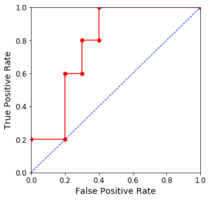

# Scikit-Learn Notes

## Thresholds in ROC Curves and P-R Curves
Whe estimating these curves, it is natural to question where do the thresholds come from, as they are automatically computed when evaluating such curves.

The reason you can't control the thresholds is to avoid using redundant thresholds. Suppose that you dataset consist of N distinct samples, and the classifier trained uses `decision_function` to compute the score of each entry.

```python
from sklearn.linear_model import LogisticRegression

model = LogisticRegression()
model.fit(X_train, y_train)
scores = model.decision_function(X_test)
```

The `decision_function` in Scikit-Learn calculates the distance from the sample to the separating hyperplane. If we want to plot a ROC Curve, there is no reason to evaluate thresholds that are in-between samples since neither the True Positive Rate nor False Positive Rate would change. This is the reason why instead of testing a big number of thresholds we just evaluate N, where each threshold corresponds to the score for a particular sample. Furthermore, if we increase the False Positive Rate and the True Positive Rate stays the same, then `sklearn` discards such thresholds as they are redundant unless we set the `drop_intermediate` argument to `False`.

||||
|---------------------------------------|-----------------------------------------------------------------------|-----------------------------------------|
| ROC Curve (default)                   | ROC Curve (`drop_intermediate=False`)                                 | ROC Curve (few samples)                 |